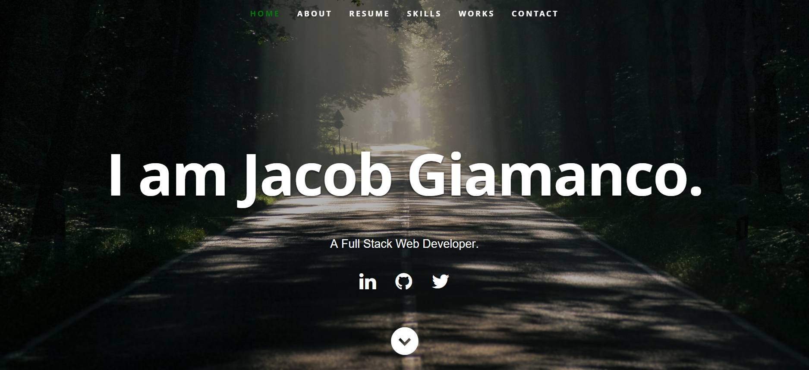

# Jacob Giamanco's Portfolio

Welcome to my portfolio website! This is a single-page application (SPA) built with React to showcase my projects, skills, and experience.

## Preview



## Technologies Used

- **React**: A JavaScript library for building user interfaces.
- **React Modal**: A library for creating accessible modal dialogs in React.
- **EmailJS**: A service to send emails directly from JavaScript.
- **CSS Flexbox**: A CSS layout module for designing responsive layouts.
- **Font Awesome**: A library for scalable vector icons.
- **jQuery**: A fast, small, and feature-rich JavaScript library.
- **HTML5**: The latest version of Hypertext Markup Language.
- **CSS3**: The latest version of Cascading Style Sheets.

## Features

- **Responsive Design**: The website is fully responsive and works on all devices.
- **Modal Contact Form**: A modal contact form that allows users to send emails directly from the website.
- **Smooth Scrolling**: Smooth scrolling navigation for a better user experience.
- **Portfolio Showcase**: A section to showcase my projects with links to live demos and GitHub repositories.
- **Skills Section**: A section to display my technical skills with icons.
- **About Section**: A section to provide information about me and my background.
- **Footer with Social Links**: A footer with links to my social media profiles.

## How to Use

1. **Clone/Download the repo**:

   ```sh
   git clone https://github.com/jgiamanco/portfolio.git
   cd portfolio
   ```

2. **Install dependencies**:

```sh
npm install
```

3. **Update resume data**: Modify the values in resumeData.js to suit your use-case.

4. **Run the development server**:

```sh
npm start
```

This will spin up the local development server at http://localhost:3000.

5. **Build for production**:

```sh
npm run build
```

This will create a production-ready build of the website.

## Deployment

The website can be deployed to any static site hosting service. Here are some popular options:

- **Netlify**: https://www.netlify.com/
- **Vercel**: https://vercel.com/
- **GitHub Pages**: https://pages.github.com/

## Contact

Feel free to reach out to me for any work, collaborations, or to get to know me better.

- **LinkedIn**: [Jacob Giamanco](http://www.linkedin.com/in/jacob-giamanco)
- **GitHub**: [jgiamanco](http://github.com/jgiamanco)

Thank you for visiting my portfolio website!
